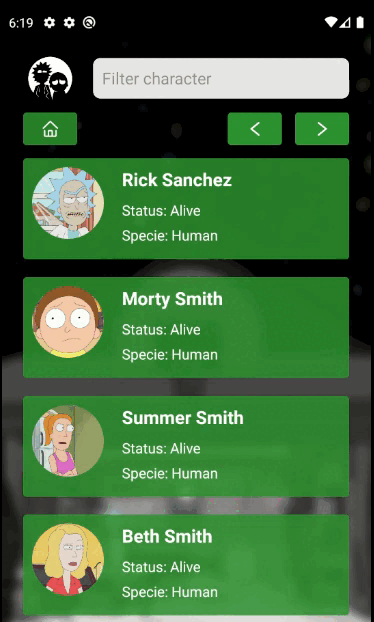
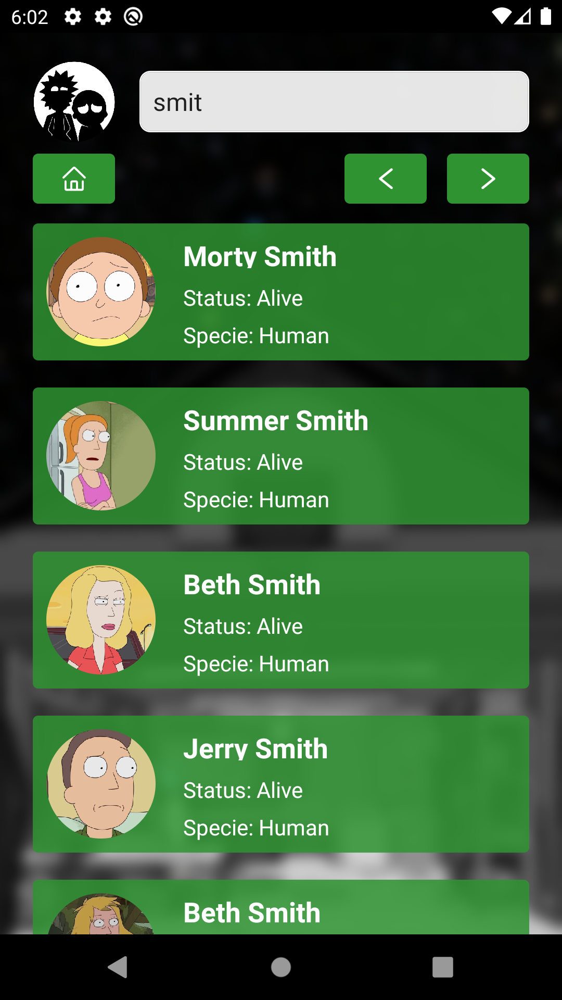
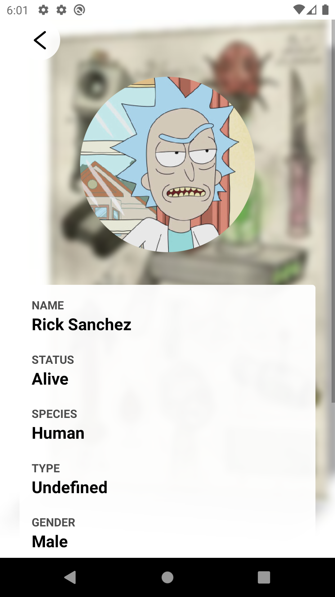

<p align="center">
  <a href="https://github.com/Luanfv/app-rpgzando">
    
  </a>

  <h3 align="center">Rick and Morty Characters</h3>

  <p align="center">
    Aplicativo de listar personagens da serie Rick and Morty, desenvolvido com React-Native
  </p>
  
  <div align="center">
    <a href="https://www.linkedin.com/in/luanfv/">
      
    </a>
    <a href="https://github.com/Luanfv">
      
    </a>
    
    
    
    
  </div>
  
  <br />
  
  <div align="center">
    <a href="https://play.google.com/store/apps/details?id=com.rickandmortycharacters">
      
    </a>
  </div>
</p>

<p align="center">
  
</p>

<br />
<br />

<!-- ABOUT THE PROJECT -->
## SOBRE O PROJETO

<p align="center">
<table  style="border: none">
  <tr>
    <td>
      
    </td>
    <td>
      
    </td>
    <td>
      
    </td>
  </tr>
</table>
</p>

Rick and Morty Characters é um aplicativo que lista os personagens da serie de TV Rick and Morty,
utiliza a api externa ```https://rickandmortyapi.com/```.

Para baixar o app, <a href="https://play.google.com/store/apps/details?id=com.rickandmortycharacters">clique aqui</a>.


<!-- Getting Started -->
## INICIANDO O PROJETO

Para instalar o projeto em sua maquina siga os passos abaixo.

### PRÉ-REQUISITOS

Tenha instalado em sua máquina as seguintes ferramentas:
[Git](https://git-scm.com), [Node.js](https://nodejs.org/en/), [Android Studio](https://developer.android.com/studio),
Opcionalmente pode-se instalar o [Yarn](https://yarnpkg.com/) como gerenciador de pacotes.

### INSTALAÇÃO

1. Clone o repositório
   ```sh
   git clone https://github.com/Luanfv/rick-and-morty-characters.git
   ```
2. Entre na pasta
   ```sh
   cd rick-and-morty-characters
   ```
3. Instale as dependências
   ```sh
   yarn
   ```
   ou
   ```sh
   npm i
   ```
